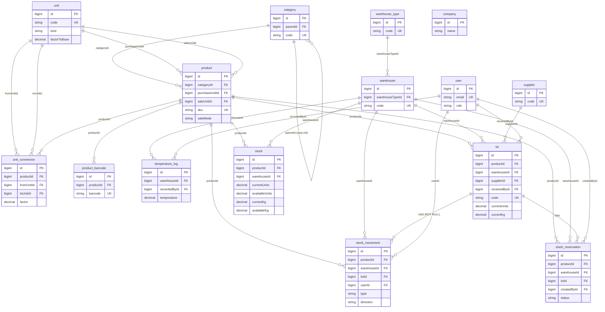

# Base de datos

Esquema relacional del backend. Complementa `CLAUDE.md` (contexto general),
`TECNICO.md` (decisiones de diseño) y `PLAN-DE-TRABAJO.md` (estado de tareas).
Documenta el esquema tal como lo definen las migraciones de la Fase 0 y la
Fase 1 (catálogo e inventario).

---

## 1. Introducción

### Propósito

Este documento describe **todas las tablas del dominio**, sus columnas
relevantes, llaves foráneas, índices y las relaciones Eloquent de cada modelo.
Es la referencia para entender cómo se guarda el inventario de peso variable,
la trazabilidad de lote y la cadena de frío.

### Convenciones OBLIGATORIAS

Están fijadas en `CLAUDE.md` §3 y se cumplen sin excepción en todo el esquema:

- **Tablas en singular**: `company`, `user`, `unit`, `product`, `lot`,
  `stock`, `stock_movement`… (no `products`, no `lots`).
- **Timestamps en camelCase**: `createdAt`, `updatedAt` y, en las tablas con
  borrado lógico, `deletedAt`. Cada modelo redefine las constantes
  `CREATED_AT` / `UPDATED_AT` / `DELETED_AT`.
- **Llaves foráneas en camelCase**: `productId`, `warehouseId`, `lotId`,
  `supplierId`, `categoryId`…
- **Columnas generadas** para saldos derivados: la base de datos calcula
  `stock.availableUnits` y `stock.availableKg` (`storedAs`); nunca se escriben
  a mano.

### NO es multi-tenant

Lo más importante y lo que más fácil se rompe por inercia (ver `CLAUDE.md` §0):

- **No existe `locationId`** en ninguna tabla, ni `TenantScope`, ni
  `BelongsToTenant`, ni ningún andamiaje de aislamiento por cliente.
- Los datos del negocio viven en **`company`, una tabla de UNA SOLA FILA**
  (`id = 1`). **Ninguna tabla del dominio tiene FK hacia `company`**: no tiene
  llaves entrantes.
- El control de acceso es sólo por `user.role`. `ADMINISTRADOR` es el rol
  máximo; no hay roles de plataforma.

### Motor y portabilidad

| Entorno | Motor |
|---|---|
| Producción | **MySQL 8.4** (vía Laragon, BD `distribuidora`) |
| Tests | **SQLite en memoria** (PHPUnit) |

Las migraciones se escriben para ser **portables a SQLite**: las FKs se
declaran dentro del `CREATE TABLE` (no con `ALTER TABLE` posterior) y se evita
sintaxis exclusiva de MySQL. El orden de las migraciones garantiza que la tabla
referida exista antes de la que la referencia. Las columnas generadas
(`storedAs`) las soportan ambos motores.

---

## 2. Diagrama entidad-relación

> `company` aparece **aislada**, sin relaciones: es la fila única del negocio y
> ninguna tabla apunta a ella. Las tablas de infraestructura de Laravel
> (`cache`, `jobs`, `sessions`, `password_reset_tokens`,
> `personal_access_tokens`) se omiten del diagrama por no ser del dominio.

---

## 3. Catálogo de tablas

### 3.1 Módulo Núcleo

#### `company` — datos y parámetros del negocio

Fila única (`id = 1`) con la identidad y los parámetros operativos del negocio.
Está en BD y no en `.env` porque el cliente debe poder ajustar el mínimo de
pedido o la tolerancia de peso sin un despliegue. **Sin FKs entrantes.**

| Columna | Tipo | Notas |
|---|---|---|
| `id` | bigint PK | Siempre 1 |
| `name` | string(150) | Nombre comercial |
| `businessName` | string(200) nullable | Razón social |
| `nit` | string(30) nullable | |
| `address`, `city`, `phone`, `whatsappPhone`, `email` | string nullable | Contacto |
| `invimaRegistration` | string(60) nullable | Registro sanitario propio (cárnicos) |
| `timezone` | string(50) | Default `America/Bogota` |
| `currency` | string(3) | Default `COP` |
| `logoPath`, `brandColor`, `tagline` | string nullable | Branding |
| `minOrderAmount` | decimal(14,2) | Mínimo de pedido; default 0 |
| `defaultWeightTolerancePercent` | decimal(5,2) | Desvío peso pedido↔despachado por defecto; default 10 |
| `reservationTtlMinutes` | smallint | Vida de una reserva antes de liberarse; default 240 |
| `createdAt`, `updatedAt` | timestamp nullable | |

- **FKs**: ninguna (ni entrantes ni salientes).
- **Modelo** `Company`: acceso vía `Company::current()` (memoiza la fila por
  petición). Expone el atributo calculado `logoUrl`. Invalida su caché en
  `saved` / `deleted`. Sin relaciones Eloquent.

#### `user` — usuarios del sistema

Login simple (correo + contraseña). Todos pertenecen al mismo negocio; lo único
que los diferencia es `role`. Sin columna de tenant ni impersonación.

| Columna | Tipo | Notas |
|---|---|---|
| `id` | bigint PK | |
| `name` | string(150) | |
| `email` | string(190) **unique** | |
| `password` | string | Cast `hashed` (red de seguridad si algún punto olvida `Hash::make`) |
| `role` | string(30) | **Enum `UserRole`** (ver §4) |
| `phone`, `documentNumber` | string(30) nullable | |
| `active` | boolean | Default true |
| `lastLoginAt` | timestamp nullable | |
| `remember_token` | string nullable | `rememberToken()` |
| `createdAt`, `updatedAt` | timestamp nullable | |

- **FKs**: ninguna saliente. Es referida por `temperature_log.recordedById`,
  `lot.receivedById`, `stock_movement.userId` y
  `stock_reservation.createdById` (todas nullable, `nullOnDelete`).
- **Índices**: `user_index_role` sobre `role`.
- **Modelo** `User`: `Authenticatable` con `HasApiTokens` (Sanctum). Cast
  `role => UserRole`. Sin relaciones Eloquent declaradas.
- **Auxiliares de auth** creados en la misma migración: `password_reset_tokens`
  (PK `email`) y `sessions` (PK `id`, con `user_id` índice). Usan la convención
  estándar de Laravel (snake_case), no la del dominio.

Tabla adicional de auth: **`personal_access_tokens`** (Sanctum), con
`morphs('tokenable')`, `token` unique y `timestamps()` estándar.

---

### 3.2 Módulo Catálogo

#### `unit` — unidades de medida

`factorToBase` expresa la unidad en la unidad base de su `kind` (kg para WEIGHT,
unidad para COUNT, litro para VOLUME): 1 lb = 0,45359237; 1 arroba = 12,5. Las
equivalencias que dependen del producto no van aquí, sino en `unit_conversion`.

| Columna | Tipo | Notas |
|---|---|---|
| `id` | bigint PK | |
| `code` | string(20) **unique** | |
| `name` | string(60) | |
| `kind` | string(20) | **Enum `UnitKind`**: `WEIGHT`, `COUNT`, `VOLUME` |
| `factorToBase` | decimal(20,10) | Default 1 |
| `isBase` | boolean | Default false |
| `decimals` | tinyint | Decimales al mostrar; default 3 |
| `active` | boolean | Default true |

- **FKs**: ninguna. Referida por `product.purchaseUnitId`, `product.saleUnitId`,
  `unit_conversion.fromUnitId`, `unit_conversion.toUnitId`.
- **Índices**: `unit_unique_code` (unique en `code`), `unit_index_kind`.
- **Modelo** `Unit`: cast `kind => UnitKind`; helpers `isWeight()`, `isCount()`.

#### `category` — árbol de categorías

Un nivel de anidamiento (Salsamentaria → Chorizos). Auto-referencia por
`parentId`.

| Columna | Tipo | Notas |
|---|---|---|
| `id` | bigint PK | |
| `parentId` | bigint nullable FK → `category` | Auto-referencia |
| `code` | string(20) **unique** | |
| `name` | string(120) | |
| `description` | string(300) nullable | |
| `displayOrder` | smallint | Default 0 |
| `active` | boolean | Default true |

- **FKs**: `parentId` → `category.id`, `nullOnDelete` (al borrar el padre los
  hijos quedan huérfanos, no se borran en cascada).
- **Índices**: `category_unique_code`, `category_index_parent`.
- **Modelo** `Category`: `parent()` (belongsTo self), `children()` (hasMany
  self), `products()` (hasMany `Product`).

#### `product` — entidad única del catálogo

**Lo que se compra y lo que se vende son la misma cosa.** El campo decisivo es
`saleMode`. Usa **soft delete** (`deletedAt`): los lotes y movimientos
históricos lo referencian, así que nunca se borra en duro.

Columnas relevantes (la tabla tiene ~45):

| Columna | Tipo | Notas |
|---|---|---|
| `id` | bigint PK | |
| `categoryId` | bigint nullable FK → `category` | `nullOnDelete` |
| `sku` | string(40) **unique** | |
| `name` | string(200) | |
| `saleMode` | string(20) | **Enum `SaleMode`**: `WEIGHT`, `UNIT`, `FIXED_PACK` |
| `tracksWeight` | boolean | Default true |
| `netWeightKg` | decimal(12,4) nullable | Obligatorio en FIXED_PACK; peso promedio de pieza en WEIGHT; NULL en UNIT |
| `weightTolerancePercent` | decimal(5,2) nullable | NULL = usar el de `company` |
| `basePrice` | decimal(14,2) | Por kg si WEIGHT; por unidad en los otros |
| `priceIncludesTax` | boolean | Default true |
| `taxPercent` | decimal(5,2) | IVA; muchos cárnicos exentos |
| `averageCostPerKg/Unit`, `lastCostPerKg/Unit` | decimal(14,4) | Referencia de precio; el costo real de venta sale del lote (FIFO) |
| `costUpdatedAt` | timestamp nullable | |
| `purchaseUnitId` | bigint nullable FK → `unit` | Unidad de compra; `nullOnDelete` |
| `saleUnitId` | bigint nullable FK → `unit` | Unidad de venta; `nullOnDelete` |
| `trackLots` | boolean | Default true |
| `shelfLifeDays` | smallint nullable | Vida útil desde fabricación |
| `expirationAlertDays` | smallint | Default 7 |
| `minStockKg/Units`, `maxStockKg/Units` | decimal(14,4) | Umbrales |
| `shrinkagePercentPerDay` | decimal(6,4) | Merma esperada por deshidratación/purga |
| `storageTempMin/Max` | decimal(5,2) nullable | Rango de conservación |
| `sellable`, `purchasable`, `temporarilyOut` | boolean | Disponibilidad |
| `displayOrder` | smallint | Default 0 |
| `active` | boolean | Default true |
| `createdAt`, `updatedAt`, `deletedAt` | timestamp nullable | Soft delete |

- **FKs**: `categoryId` → `category` (`nullOnDelete`), `purchaseUnitId` /
  `saleUnitId` → `unit` (`nullOnDelete`).
- **Índices**: `product_unique_sku`, `product_index_category`,
  `product_index_sellable` (`active`, `sellable`), `product_index_name`.
- **Modelo** `Product` (`SoftDeletes`): relaciones `category()`,
  `purchaseUnit()`, `saleUnit()` (belongsTo), `barcodes()`,
  `unitConversions()` (hasMany). Reglas de negocio: `tracksWeight()`,
  `effectiveWeightTolerancePercent()`, `estimateKgForUnits()`.

#### `unit_conversion` — equivalencias que dependen del producto

Una canastilla de chorizo santarrosano trae 12,5 kg pero de otro producto pesa
distinto: la equivalencia no puede ser global. `productId` NULL = conversión
válida para cualquier producto (empaques estandarizados).

| Columna | Tipo | Notas |
|---|---|---|
| `id` | bigint PK | |
| `productId` | bigint nullable FK → `product` | `cascadeOnDelete`; NULL = global |
| `fromUnitId` | bigint FK → `unit` | Obligatorio |
| `toUnitId` | bigint FK → `unit` | Obligatorio |
| `factor` | decimal(20,10) | `1 fromUnit = factor × toUnit` |

- **FKs**: `productId` → `product` (`cascadeOnDelete`); `fromUnitId`,
  `toUnitId` → `unit` (restrict por defecto).
- **Índices**: `unit_conversion_unique` (unique en
  `productId, fromUnitId, toUnitId`), `unit_conversion_index_product`.
- **Modelo** `UnitConversion`: `product()`, `fromUnit()`, `toUnit()`
  (belongsTo).

#### `product_barcode` — códigos de barras del producto

Un producto puede tener varios códigos (fabricante, caja, báscula).
`isWeightEmbedded` marca los EAN-13 de báscula con el peso embebido (prefijo
2x): al escanearlos se extrae el peso del propio código.

| Columna | Tipo | Notas |
|---|---|---|
| `id` | bigint PK | |
| `productId` | bigint FK → `product` | `cascadeOnDelete` |
| `barcode` | string(60) **unique** | |
| `label` | string(60) nullable | "caja x 10", "báscula" |
| `isWeightEmbedded` | boolean | Default false |
| `isPrimary` | boolean | Default false |

- **FKs**: `productId` → `product` (`cascadeOnDelete`).
- **Índices**: `product_barcode_unique` (unique en `barcode`),
  `product_barcode_index_product`.
- **Modelo** `ProductBarcode`: `product()` (belongsTo).

#### `supplier` — proveedores

El lote apunta aquí por FK, no por texto libre: ante un retiro hay que agrupar
por proveedor real. Usa **soft delete**.

| Columna | Tipo | Notas |
|---|---|---|
| `id` | bigint PK | |
| `code` | string(20) **unique** | |
| `name` | string(200) | |
| `nit` | string(30) nullable | |
| `contactName`, `phone`, `email`, `address`, `city` | nullable | Contacto |
| `invimaRegistration` | string(60) nullable | Registro sanitario del proveedor |
| `paymentTermDays` | smallint | Default 0 |
| `notes` | string(500) nullable | |
| `active` | boolean | Default true |
| `createdAt`, `updatedAt`, `deletedAt` | timestamp nullable | Soft delete |

- **FKs**: ninguna saliente. Referida por `lot.supplierId`.
- **Índices**: `supplier_unique_code`, `supplier_index_active`,
  `supplier_index_name`.
- **Modelo** `Supplier` (`SoftDeletes`): `lots()` (hasMany `Lot`).

---

### 3.3 Módulo Bodegas y cadena de frío

#### `warehouse_type` — tipos de bodega

Congelación, refrigeración, seco, despacho, cuarentena. Es tabla y no enum
porque cada negocio nombra y parametriza sus cuartos distinto, y el rango de
temperatura por defecto vive aquí.

| Columna | Tipo | Notas |
|---|---|---|
| `id` | bigint PK | |
| `code` | string(20) **unique** | |
| `name` | string(80) | |
| `defaultTempMin/Max` | decimal(5,2) nullable | Rango por defecto |
| `requiresColdChain` | boolean | Default false |
| `active` | boolean | Default true |

- **FKs**: ninguna. Referida por `warehouse.warehouseTypeId`.
- **Índices**: `warehouse_type_unique_code`.
- **Modelo** `WarehouseType`: `warehouses()` (hasMany `Warehouse`).

#### `warehouse` — bodegas físicas

`isQuarantine` marca la bodega de mercancía retenida (su stock no es vendible).
El rango propio, si es NULL, se hereda del `warehouse_type`.

| Columna | Tipo | Notas |
|---|---|---|
| `id` | bigint PK | |
| `warehouseTypeId` | bigint nullable FK → `warehouse_type` | `nullOnDelete` |
| `code` | string(20) **unique** | |
| `name` | string(120) | |
| `description` | string(300) nullable | |
| `tempMin/Max` | decimal(5,2) nullable | NULL = hereda del tipo |
| `isDefault` | boolean | Default false |
| `isQuarantine` | boolean | Default false; su stock no despacha |
| `sellable` | boolean | Default true |
| `active` | boolean | Default true |

- **FKs**: `warehouseTypeId` → `warehouse_type` (`nullOnDelete`).
- **Índices**: `warehouse_unique_code`, `warehouse_index_active`.
- **Modelo** `Warehouse`: `warehouseType()` (belongsTo), `temperatureLogs()`
  (hasMany). Reglas: `effectiveTempRange()`, `canDispatch()` (activa, vendible
  y no cuarentena).

#### `temperature_log` — bitácora de temperatura

Sin lecturas no hay cadena de frío demostrable. `outOfRange` se calcula al
registrar y se persiste; `expectedMin/Max` son un snapshot del rango vigente al
momento de la lectura (el rango puede cambiar después).

| Columna | Tipo | Notas |
|---|---|---|
| `id` | bigint PK | |
| `warehouseId` | bigint FK → `warehouse` | `cascadeOnDelete` |
| `temperature` | decimal(5,2) | Lectura |
| `expectedMin/Max` | decimal(5,2) nullable | Snapshot del rango vigente |
| `outOfRange` | boolean | Default false; se persiste para indexar |
| `source` | string(20) | Default `MANUAL`; también `SENSOR` |
| `notes` | string(300) nullable | |
| `recordedById` | bigint nullable FK → `user` | `nullOnDelete` |
| `recordedAt` | timestamp | Momento de la lectura |

- **FKs**: `warehouseId` → `warehouse` (`cascadeOnDelete`), `recordedById` →
  `user` (`nullOnDelete`).
- **Índices**: `temperature_log_index_warehouse_time`
  (`warehouseId, recordedAt`), `temperature_log_index_alerts` (`outOfRange`).
- **Modelo** `TemperatureLog`: `warehouse()`, `recordedBy()` (belongsTo).

---

### 3.4 Módulo Inventario

#### `lot` — lotes de producto

**Unidad mínima de trazabilidad: todo movimiento del kardex apunta a un lote.**
Lleva **doble saldo** (`currentUnits` + `currentKg`) porque en peso variable
ambos se consumen a ritmos distintos. `supplierLotCode` es el lote del
FABRICANTE, el que aparece en un retiro del INVIMA. Usa **soft delete**.

| Columna | Tipo | Notas |
|---|---|---|
| `id` | bigint PK | |
| `productId` | bigint FK → `product` | `cascadeOnDelete` |
| `warehouseId` | bigint FK → `warehouse` | restrict (sin acción declarada) |
| `supplierId` | bigint nullable FK → `supplier` | `nullOnDelete` |
| `code` | string(40) **unique** | Consecutivo interno `LOT-000123` |
| `supplierLotCode` | string(60) nullable | Lote del fabricante |
| `purchaseInvoice` | string(60) nullable | |
| `initialUnits`, `currentUnits` | decimal(16,4) | Saldo en piezas |
| `initialKg`, `currentKg` | decimal(16,4) | Saldo en peso |
| `costPerUnit`, `costPerKg` | decimal(16,4) | Snapshot inmutable de recepción |
| `totalCost` | decimal(16,2) | |
| `receivedAt` | date | |
| `expirationDate` | date nullable | Ordena el FIFO |
| `manufacturingDate` | date nullable | |
| `status` | string(20) | **Enum `LotStatus`**; default `ACTIVE` |
| `qrCode` | string(200) nullable | |
| `labelPrinted` | boolean + `labelPrintedAt` | |
| `notes` | string(500) nullable | |
| `receivedById` | bigint nullable FK → `user` | `nullOnDelete` |
| `createdAt`, `updatedAt`, `deletedAt` | timestamp nullable | Soft delete |

- **FKs**: `productId` → `product` (`cascadeOnDelete`), `warehouseId` →
  `warehouse` (restrict), `supplierId` → `supplier` (`nullOnDelete`),
  `receivedById` → `user` (`nullOnDelete`).
- **Índices**: `lot_unique_code`; `lot_index_fifo`
  (`productId, warehouseId, status, expirationDate` — el índice del FIFO);
  `lot_index_expiring` (`expirationDate`); `lot_index_supplier_lot`.
- **Modelo** `Lot` (`SoftDeletes`): `product()`, `warehouse()`, `supplier()`,
  `receivedBy()` (belongsTo), `movements()` (hasMany `StockMovement`). Scopes
  `fifo()` (activos, ordenados por vencimiento con los sin fecha al final) y
  `withStock()`. Reglas: `isExpired()`, `daysToExpiration()`,
  `isNearExpiration()`, `isDepleted()`.

#### `stock` — saldo desnormalizado por (producto, bodega)

Existe **sólo por performance**: la verdad está en `stock_movement` y en la suma
de `lot`. `ReconcileStockJob` compara las tres fuentes y alerta si divergen.

**`availableUnits` y `availableKg` son COLUMNAS GENERADAS por la base de datos**
(`storedAs`): es imposible que se desincronicen y **no son asignables** desde el
modelo (quedan fuera de `$fillable`; escribirlas rompería el INSERT).

| Columna | Tipo | Notas |
|---|---|---|
| `id` | bigint PK | |
| `productId` | bigint FK → `product` | `cascadeOnDelete` |
| `warehouseId` | bigint FK → `warehouse` | `cascadeOnDelete` |
| `currentUnits` | decimal(16,4) | Default 0 |
| `reservedUnits` | decimal(16,4) | Default 0 |
| **`availableUnits`** | decimal(16,4) **GENERADA** | `storedAs('currentUnits - reservedUnits')` |
| `currentKg` | decimal(16,4) | Default 0 |
| `reservedKg` | decimal(16,4) | Default 0 |
| **`availableKg`** | decimal(16,4) **GENERADA** | `storedAs('currentKg - reservedKg')` |
| `lastMovementAt`, `lastCountAt` | timestamp nullable | |

- **FKs**: `productId`, `warehouseId` → respectivas tablas (`cascadeOnDelete`).
- **Índices**: `stock_unique_product_warehouse` (unique en
  `productId, warehouseId`), `stock_index_product`.
- **Modelo** `Stock`: `product()`, `warehouse()` (belongsTo). Las dos columnas
  generadas se castean a `decimal:4` para lectura pero no están en `$fillable`.

#### `stock_movement` — libro mayor del inventario

**INMUTABLE**: nunca se edita ni se borra una fila; un error se corrige con un
movimiento contrario. El modelo bloquea `update` y `delete` en sus eventos
(lanzan `LogicException`).

**`lotId` es NOT NULL a propósito**: sin lote no hay movimiento (trazabilidad de
cárnicos). Las cantidades se guardan siempre POSITIVAS; el signo lo da
`direction`. Los `*Before` / `*After` son el saldo de la combinación
(producto, bodega) antes y después, para auditar el kardex línea por línea.

| Columna | Tipo | Notas |
|---|---|---|
| `id` | bigint PK | |
| `productId` | bigint FK → `product` | restrict |
| `warehouseId` | bigint FK → `warehouse` | restrict |
| `lotId` | bigint FK → `lot` | **NOT NULL** (obligatorio) |
| `type` | string(30) | **Enum `MovementType`** |
| `direction` | string(3) | **Enum `MovementDirection`**: `IN`, `OUT` |
| `units`, `kg` | decimal(16,4) | Siempre positivas |
| `costPerUnit`, `costPerKg` | decimal(16,4) | |
| `totalCost` | decimal(16,2) | |
| `unitsBefore/After`, `kgBefore/After` | decimal(16,4) | Saldo antes/después |
| `referenceType` | string(40) nullable | Documento origen (pedido, recepción, merma…) |
| `referenceId` | bigint nullable | |
| `userId` | bigint nullable FK → `user` | `nullOnDelete` |
| `notes` | string(500) nullable | |
| `movementDate` | timestamp | |

- **FKs**: `productId` → `product` (restrict), `warehouseId` → `warehouse`
  (restrict), `lotId` → `lot` (restrict, **NOT NULL**), `userId` → `user`
  (`nullOnDelete`).
- **Índices**: `stock_movement_index_kardex`
  (`productId, warehouseId, movementDate`), `stock_movement_index_lot`,
  `stock_movement_index_reference` (`referenceType, referenceId`),
  `stock_movement_index_type` (`type, movementDate`).
- **Modelo** `StockMovement`: `product()`, `warehouse()`, `lot()`, `user()`
  (belongsTo). Casts `type => MovementType`, `direction => MovementDirection`.
  Helpers `signedUnits()`, `signedKg()` (aplican `direction->sign()`).
  Eventos `updating` / `deleting` lanzan excepción: **inmutable**.

#### `stock_reservation` — apartado de stock con dueño y vencimiento

Cada reserva conoce su documento origen (`referenceType` / `referenceId`) y
expira, para que una reserva huérfana no bloquee stock para siempre y para saber
QUIÉN apartó. `lotId` es opcional: al confirmar un pedido se aparta cantidad del
producto y el lote concreto se decide al alistar (FIFO).

| Columna | Tipo | Notas |
|---|---|---|
| `id` | bigint PK | |
| `productId` | bigint FK → `product` | `cascadeOnDelete` |
| `warehouseId` | bigint FK → `warehouse` | `cascadeOnDelete` |
| `lotId` | bigint nullable FK → `lot` | `nullOnDelete`; se decide al alistar |
| `units`, `kg` | decimal(16,4) | Default 0 |
| `status` | string(20) | **Enum `ReservationStatus`**; default `ACTIVE` |
| `referenceType` | string(40) | Obligatorio; p. ej. `order` |
| `referenceId` | bigint | Obligatorio |
| `expiresAt` | timestamp nullable | NULL = no expira sola |
| `resolvedAt` | timestamp nullable | |
| `createdById` | bigint nullable FK → `user` | `nullOnDelete` |
| `notes` | string(300) nullable | |

- **FKs**: `productId`, `warehouseId` → respectivas (`cascadeOnDelete`),
  `lotId` → `lot` (`nullOnDelete`), `createdById` → `user` (`nullOnDelete`).
- **Índices**: `stock_reservation_index_stock`
  (`productId, warehouseId, status`), `stock_reservation_index_reference`
  (`referenceType, referenceId`), `stock_reservation_index_expiry`
  (`status, expiresAt` — barrido de reservas vencidas).
- **Modelo** `StockReservation`: `product()`, `warehouse()`, `lot()`
  (belongsTo). Scopes `active()` y `expirable()` (activas, con `expiresAt`
  vencido).

---

## 4. Enums del esquema

Valores posibles de las columnas string que representan un enum de PHP.

### `UnitKind` — `unit.kind`
Naturaleza física de la unidad; sólo se convierte entre unidades del mismo kind.

| Valor | Significado |
|---|---|
| `WEIGHT` | kg, g, lb, arroba |
| `COUNT` | unidad, paquete, canastilla, caja |
| `VOLUME` | l, ml (poco usado; existe en salmueras) |

### `SaleMode` — `product.saleMode`
Cómo se vende y factura un producto. Decisión estructural del sistema.

| Valor | Significado |
|---|---|
| `WEIGHT` | Peso variable: precio por kg, el peso real se captura al alistar |
| `UNIT` | Por unidad; el peso no interviene (ni en precio ni en inventario) |
| `FIXED_PACK` | Se cobra por unidad pero descuenta `netWeightKg` de peso por unidad |

`SaleMode::driver()` devuelve `QuantityDriver`: `WEIGHT` → `KG`, los otros dos → `UNITS`.

### `QuantityDriver`
Cuál de los dos saldos manda en una operación (no es columna directa; lo deriva
`SaleMode`). Valores: `KG`, `UNITS`.

### `LotStatus` — `lot.status`
Sólo `ACTIVE` participa del FIFO.

| Valor | Significado |
|---|---|
| `ACTIVE` | Activo; puede despachar |
| `DEPLETED` | Agotado; se marca solo al llegar a cero |
| `QUARANTINE` | Retenido: sospecha de calidad o cadena de frío rota |
| `EXPIRED` | Vencido; no despacha |
| `VOID` | Anulado por error de recepción |

### `MovementDirection` — `stock_movement.direction`
Signo del movimiento (`sign()` = +1 / −1).

| Valor | Significado |
|---|---|
| `IN` | Entrada (+1) |
| `OUT` | Salida (−1) |

### `MovementType` — `stock_movement.type`
Motivo del movimiento. `direction()` devuelve la dirección natural de cada tipo.

| Valor | Dirección | Significado |
|---|---|---|
| `PURCHASE` | IN | Recepción de compra |
| `SALE` | OUT | Despacho a cliente |
| `RETURN_FROM_CUSTOMER` | IN | Devolución de cliente |
| `RETURN_TO_SUPPLIER` | OUT | Devolución a proveedor |
| `WASTE` | OUT | Merma |
| `ADJUSTMENT_IN` | IN | Ajuste manual o por conteo (entrada) |
| `ADJUSTMENT_OUT` | OUT | Ajuste (salida) |
| `TRANSFER_IN` | IN | Traslado entre bodegas (entrada) |
| `TRANSFER_OUT` | OUT | Traslado (salida) |
| `PRODUCTION_IN` | IN | Salida de maquila/despiece |
| `PRODUCTION_OUT` | OUT | Insumo consumido por la maquila |
| `VOID_LOT` | OUT | Anulación de un lote mal recibido |

### `ReservationStatus` — `stock_reservation.status`
Sólo `ACTIVE` sigue restando del stock disponible (`holdsStock()`).

| Valor | Significado |
|---|---|
| `ACTIVE` | Aparta stock; resta del disponible |
| `CONSUMED` | Se despachó: el stock ya salió del kardex |
| `RELEASED` | Liberada a mano (pedido cancelado o editado) |
| `EXPIRED` | Liberada por vencimiento de `expiresAt` |

### `UserRole` — `user.role`
Puestos reales de la distribuidora. `ADMINISTRADOR` es el rol máximo (no hay
roles de plataforma). Los permisos finos son métodos del enum
(`canManageInventory()`, `canPickAndPack()`, `canAuthorizeOverrides()`, etc.).

| Valor | Qué hace |
|---|---|
| `ADMINISTRADOR` | Dueño o gerente. Acceso total, incluidos costos y cartera |
| `VENDEDOR` | Toma pedidos y gestiona clientes |
| `CAJERO` | Caja, cobros, arqueo |
| `ALMACENISTA` | Recepción, traslados, conteos, mermas |
| `EMPACADOR` | Alistamiento y embalaje (captura el peso real) |
| `MAQUILADOR` | Órdenes de despiece y porcionado |
| `DOMICILIARIO` | Transporte y entrega |

---

## 5. Notas de integridad relacional

### 5.1 `stock_movement.lotId` es NOT NULL (trazabilidad)

Es la corrección más importante respecto a DaliOrder. Allá el lote podía faltar
y el sistema seguía adelante con un `Log::warning`, dejando kilos vendidos sin
lote de origen. En cárnicos eso destruye la trazabilidad hacia atrás y hace
imposible un retiro de producto. Aquí **sin lote no hay movimiento**: la FK es
obligatoria a nivel de esquema, y por eso su acción de borrado es la restrictiva
por defecto (no se puede borrar un lote con movimientos).

### 5.2 `user` ↔ `company`: sin ciclo

En un diseño multi-tenant `user` apuntaría a la sede/tenant y habría que resolver
el orden de creación de tablas. **Aquí no hay tal FK**: `company` es fila única
sin llaves entrantes y `user` no tiene columna de negocio. No existe ciclo que
resolver porque no existe la relación: los usuarios no "pertenecen" a una fila de
`company`, pertenecen implícitamente al único negocio. Esto mantiene las
migraciones ordenables y portables a SQLite sin `ALTER TABLE`.

### 5.3 Borrado de producto y proveedor: soft delete

`product`, `supplier` y `lot` usan **borrado lógico** (`deletedAt`). Un producto
no puede desaparecer en duro porque `lot` y `stock_movement` lo referencian con
FK restrictiva, y esos registros históricos deben sobrevivir para el kardex y la
trazabilidad. El soft delete lo saca del catálogo activo sin romper la historia.
Igual `supplier`: un retiro puede necesitar agrupar por un proveedor que ya no se
usa.

### 5.4 Acciones onDelete por familia

- **`cascadeOnDelete`** en dependientes puros: `product_barcode`,
  `unit_conversion` (cuando tiene producto), `temperature_log`, y los saldos
  `stock` / `stock_reservation` respecto a `product` y `warehouse`. Si el padre
  desaparece, estos registros no tienen sentido por sí solos.
- **`nullOnDelete`** en referencias de conveniencia: `product.categoryId`,
  `product.purchase/saleUnitId`, `lot.supplierId`, y todos los `*ById` de
  usuario (`recordedById`, `receivedById`, `userId`, `createdById`). Perder el
  padre no invalida el registro; sólo se pierde el enlace.
- **restrict** (sin acción declarada, comportamiento por defecto) donde el
  borrado del padre NO debe ocurrir si hay hijos: `lot.warehouseId` y las tres
  FKs de `stock_movement` (`productId`, `warehouseId`, `lotId`). Protege la
  integridad del libro mayor.

### 5.5 Columnas generadas: cuadre garantizado

`stock.availableUnits` y `stock.availableKg` las calcula la BD (`storedAs`). En
DaliOrder el disponible se recalculaba a mano en cada `save()`, y cualquier
camino que lo olvidara lo dejaba desactualizado. Siendo generadas es
**imposible** que `available` difiera de `current − reserved`. El modelo las
excluye de `$fillable` para que ningún INSERT intente escribirlas.

### 5.6 Triple fuente de verdad conciliada

El saldo vive desnormalizado en `stock` (por performance) pero la verdad está en
la suma de `stock_movement` y en la suma de `lot`. `ReconcileStockJob`
(diario) compara las tres y alerta si divergen. Ninguna escritura de saldo debe
hacerse por fuera de `InventoryService`.

### 5.7 Reservas con lote opcional

`stock_reservation.lotId` es nullable a propósito: al confirmar un pedido se
aparta cantidad del **producto** (resta del disponible vía `reservedUnits` /
`reservedKg`), y el **lote concreto se decide al alistar** siguiendo el FIFO. La
reserva expira (`expiresAt`, TTL en `company.reservationTtlMinutes`) para que un
pedido abandonado no bloquee stock indefinidamente.
